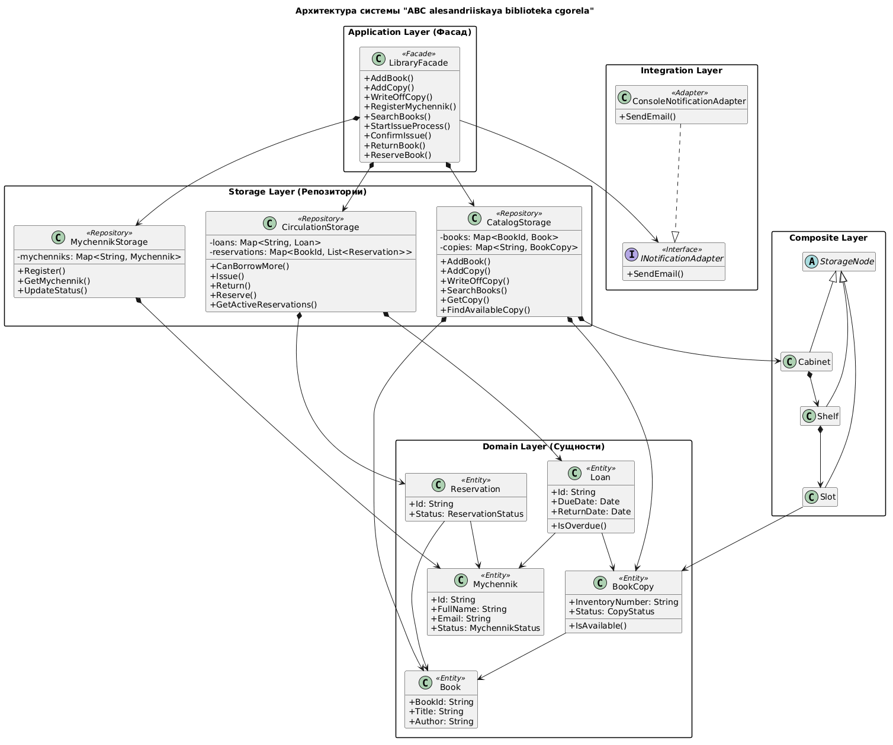
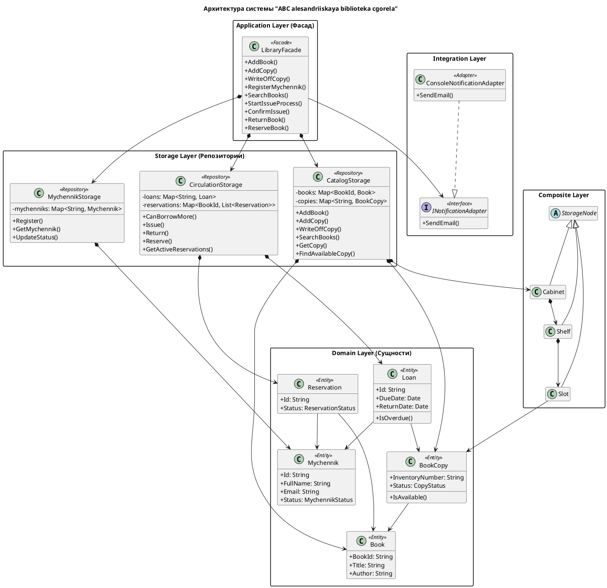

```plantuml
@startuml
skinparam classAttributeIconSize 0
skinparam packageStyle rectangle
hide empty members

title Архитектура системы "ABC alesandriiskaya biblioteka cgorela"

' --- Application Layer ---
package "Application Layer (Фасад)" {
    class LibraryFacade <<Facade>> {
        + AddBook()
        + AddCopy()
        + WriteOffCopy()
        + RegisterMychennik()
        + SearchBooks()
        + StartIssueProcess()
        + ConfirmIssue()
        + ReturnBook()
        + ReserveBook()
    }
}

' --- Storages ---
package "Storage Layer (Репозитории)" {
    class CatalogStorage <<Repository>> {
        - books: Map<BookId, Book>
        - copies: Map<String, BookCopy>
        + AddBook()
        + AddCopy()
        + WriteOffCopy()
        + SearchBooks()
        + GetCopy()
        + FindAvailableCopy()
    }

    class MychennikStorage <<Repository>> {
        - mychenniks: Map<String, Mychennik>
        + Register()
        + GetMychennik()
        + UpdateStatus()
    }

    class CirculationStorage <<Repository>> {
        - loans: Map<String, Loan>
        - reservations: Map<BookId, List<Reservation>>
        + CanBorrowMore()
        + Issue()
        + Return()
        + Reserve()
        + GetActiveReservations()
    }
}

' --- Domain Layer ---
package "Domain Layer (Сущности)" {
    class Book <<Entity>> {
        + BookId: String
        + Title: String
        + Author: String
    }

    class BookCopy <<Entity>> {
        + InventoryNumber: String
        + Status: CopyStatus
        + IsAvailable()
    }

    class Mychennik <<Entity>> {
        + Id: String
        + FullName: String
        + Email: String
        + Status: MychennikStatus
    }

    class Loan <<Entity>> {
        + Id: String
        + DueDate: Date
        + ReturnDate: Date
        + IsOverdue()
    }

    class Reservation <<Entity>> {
        + Id: String
        + Status: ReservationStatus
    }
}

' --- Composite Layer ---
package "Composite Layer" {
    abstract class StorageNode
    class Cabinet extends StorageNode
    class Shelf extends StorageNode
    class Slot extends StorageNode
}

' --- Integration Layer ---
package "Integration Layer" {
    interface INotificationAdapter <<Interface>> {
        + SendEmail()
    }
    class ConsoleNotificationAdapter <<Adapter>> {
        + SendEmail()
    }
}

' --- Relationships ---
LibraryFacade *--> CatalogStorage
LibraryFacade *--> MychennikStorage
LibraryFacade *--> CirculationStorage
LibraryFacade --> INotificationAdapter

CatalogStorage *--> Book
CatalogStorage *--> BookCopy
CatalogStorage *--> Cabinet

MychennikStorage *--> Mychennik
CirculationStorage *--> Loan
CirculationStorage *--> Reservation

Cabinet *--> Shelf
Shelf *--> Slot
Slot --> BookCopy

BookCopy --> Book
Loan --> Mychennik
Loan --> BookCopy
Reservation --> Mychennik
Reservation --> Book

ConsoleNotificationAdapter ..|> INotificationAdapter
@enduml
```