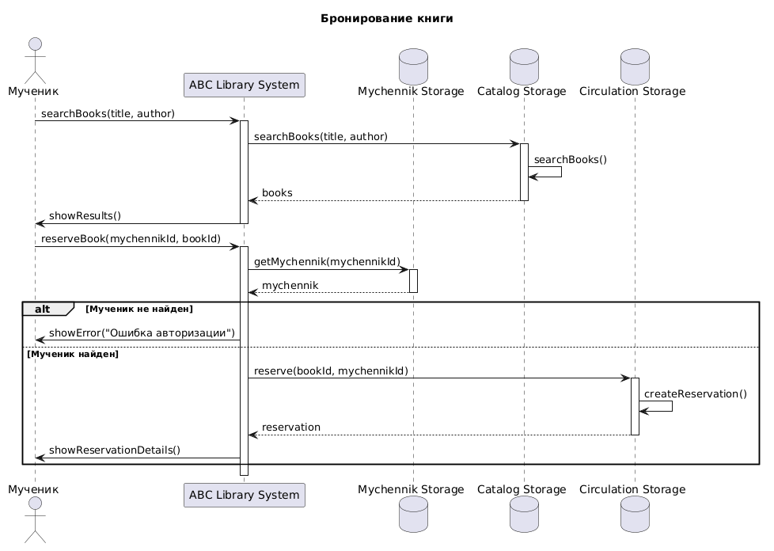
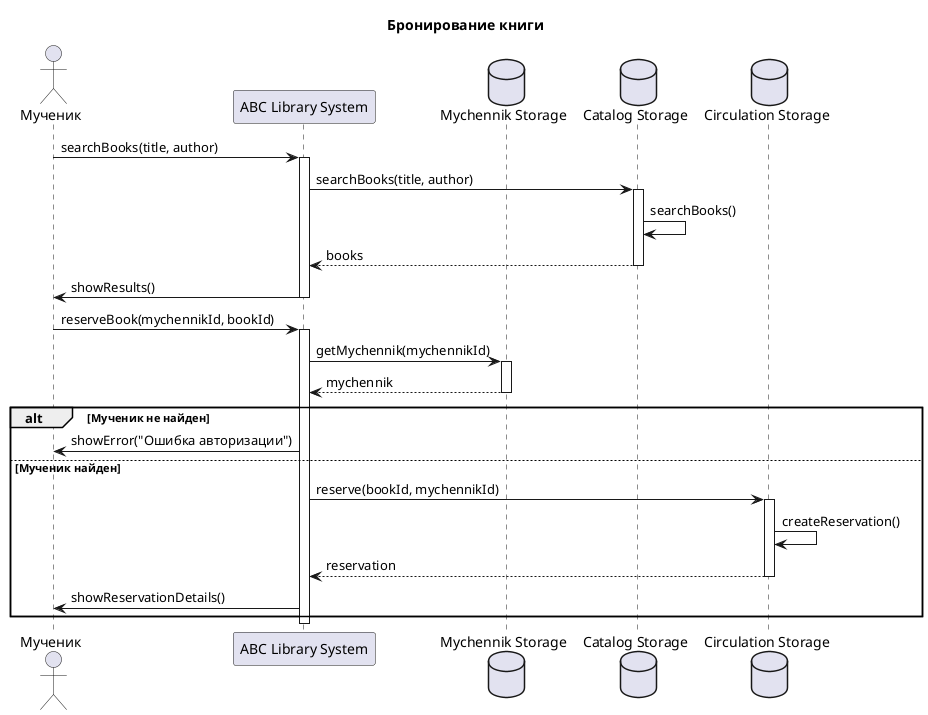

```plantuml
@startuml
title Бронирование книги

actor "Мученик" as MychennikUser
participant "ABC Library System" as Facade
database "Mychennik Storage" as MychennikStore
database "Catalog Storage" as CatalogStore
database "Circulation Storage" as CircStore

MychennikUser -> Facade : searchBooks(title, author)
activate Facade
Facade -> CatalogStore : searchBooks(title, author)
activate CatalogStore
CatalogStore -> CatalogStore : searchBooks()
CatalogStore --> Facade : books
deactivate CatalogStore
Facade -> MychennikUser : showResults()
deactivate Facade

MychennikUser -> Facade : reserveBook(mychennikId, bookId)
activate Facade
Facade -> MychennikStore : getMychennik(mychennikId)
activate MychennikStore
MychennikStore --> Facade : mychennik
deactivate MychennikStore

alt Мученик не найден
    Facade -> MychennikUser : showError("Ошибка авторизации")
else Мученик найден
    Facade -> CircStore : reserve(bookId, mychennikId)
    activate CircStore
    CircStore -> CircStore : createReservation()
    CircStore --> Facade : reservation
    deactivate CircStore
    
    Facade -> MychennikUser : showReservationDetails()
end
deactivate Facade

@enduml
```