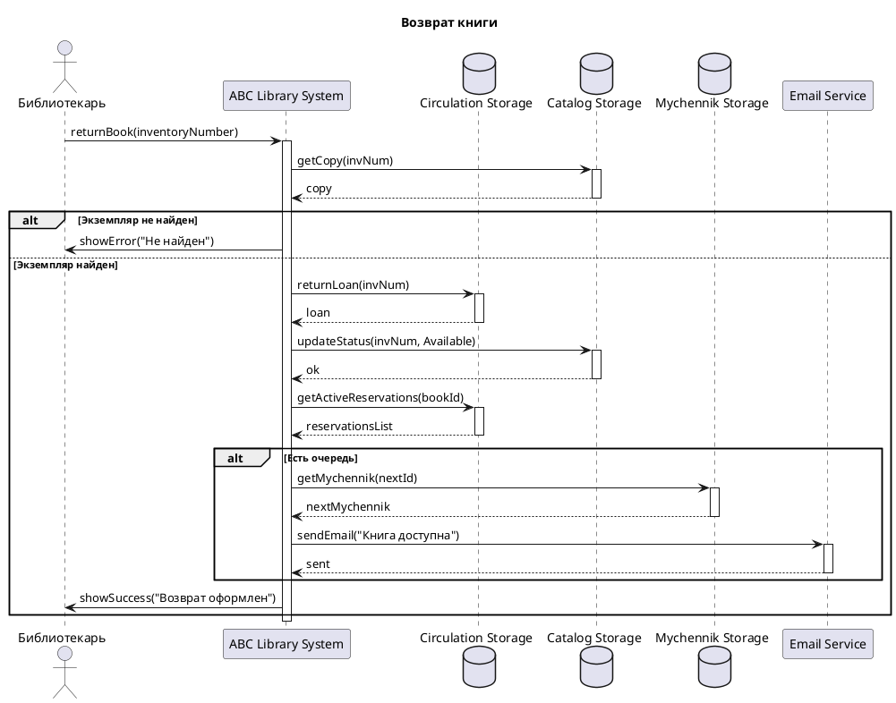

!\[return](../../images/return.png)

```plantuml


@startuml

title Возврат книги


actor "Библиотекарь" as Librarian

participant "ABC Library System" as Facade

database "Circulation Storage" as CircStore

database "Catalog Storage" as CatalogStore

database "Mychennik Storage" as MychennikStore

participant "Email Service" as Email


Librarian -> Facade : returnBook(inventoryNumber)

activate Facade

Facade -> CatalogStore : getCopy(invNum)

activate CatalogStore

CatalogStore --> Facade : copy

deactivate CatalogStore


alt Экземпляр не найден

Facade -> Librarian : showError("Не найден")

else Экземпляр найден

Facade -> CircStore : returnLoan(invNum)

activate CircStore

CircStore --> Facade : loan

deactivate CircStore


Facade -> CatalogStore : updateStatus(invNum, Available)

activate CatalogStore

CatalogStore --> Facade : ok

deactivate CatalogStore


Facade -> CircStore : getActiveReservations(bookId)

activate CircStore

CircStore --> Facade : reservationsList

deactivate CircStore


alt Есть очередь

Facade -> MychennikStore : getMychennik(nextId)

activate MychennikStore

MychennikStore --> Facade : nextMychennik

deactivate MychennikStore


Facade -> Email : sendEmail("Книга доступна")

activate Email

Email --> Facade : sent

deactivate Email

end


Facade -> Librarian : showSuccess("Возврат оформлен")

end

deactivate Facade

@enduml


```

